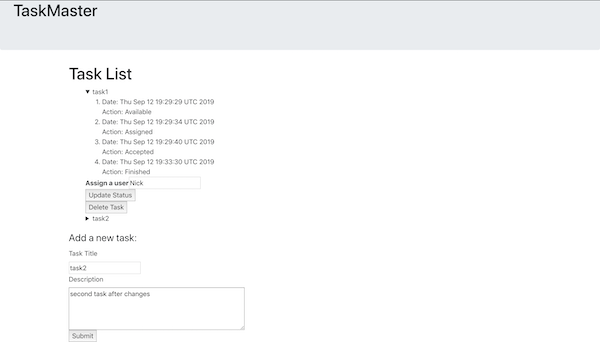

# frontend-taskmaster

### Description
TaskMaster allows a user to create a task, assign that task to a new user, move the task through the status changes ("Available" -> "Assigned" -> "Accepted -> "Finished"), and delete the tasks.

### Screenshot


### Links
* [Frontend](http://taskmaster-np.s3-website-us-west-2.amazonaws.com/)
* [Backend](https://cdmrys6wnc.execute-api.us-west-2.amazonaws.com/dev/tasks)

### API Routes:
* https://cdmrys6wnc.execute-api.us-west-2.amazonaws.com/dev/tasks
  * `POST` - add a new task
    * add a new task with a JSON object:
    ```
    {
      "title": "ADD A TITLE HERE",
      "description": "ADD A DESCRIPTION HERE"
    }
    ```
  * `GET` - get all tasks
* https://cdmrys6wnc.execute-api.us-west-2.amazonaws.com/dev/tasks/subscribe
  * `POST` - subscribe by phone number for an sms to the `TaskComplete` SNS service
* https://cdmrys6wnc.execute-api.us-west-2.amazonaws.com/dev/tasks/{user}
  * `GET` - get all tasks for a specific `assignee` (user)
  * `DELETE` - delete a specific task by `id` (user)
* https://cdmrys6wnc.execute-api.us-west-2.amazonaws.com/dev/tasks/{user}/assign/{assignee}
  * `PUT` - add an `assignee` (assignee) to a specific task by `id` (user)
* https://cdmrys6wnc.execute-api.us-west-2.amazonaws.com/dev/tasks/{user}/state
  * `PUT` - update the task's status by its `id` (user)

### Lambda Functions
* Java
  * [save](./lambda-dynamo/src/main/java/lambda/dynamo/Library.java) - handles the `POST` request to add a new task to the database
  * [getTasks](./lambda-dynamo/src/main/java/lambda/dynamo/Library.java) - handles the `GET` request to get all of the tasks from the database
* JavaScript
  * [getAllForOneUser](./lambda-dynamo-events/oneUser.js) - handles the `GET` request to get all of the tasks for ONE user/assignee
  * [taskDelete](./lambda-dynamo-events/delete.js) - handles the `DELETE` request to remove a task from the database
  * [updateAssignee](./lambda-dynamo-events/assignee.js) - handles the `PUT` request to add or update the assignee within a specific task. Also updates the history list with a new event
  * [changeStatus](./lambda-dynamo-events/status.js) - handles the `PUT` request to change the status of a specific task. Also updates the history list with a new event
  * [subscribe](./lambda-sns/subscribe.js) - handles the `POST` request to subscribe to the SNS to allow messages to be received
  * [notify](./lambda-sns/notify.js) - handles the DynamoDB trigger which utilizes the SNS to send a message to any subscribed users when a task is marked as 'Finished'

# Creation Steps
* Follow these steps for the creation of the [SNS Lambda Functions](https://github.com/nparo-401/sns/blob/master/README.md)

### Resources
* Marisha Hoza
* Fabian Brooks
* Kevin Couture
* Melfi Perez
* [Fetch](https://developer.mozilla.org/en-US/docs/Web/API/Fetch_API/Using_Fetch)
* [Stackoverflow Fetch](https://stackoverflow.com/questions/40284338/javascript-fetch-delete-and-put-requests)
* [HTML Fieldset](https://www.w3schools.com/tags/tag_fieldset.asp)
* [React Bootstrap](https://react-bootstrap.github.io/getting-started/introduction/)
* [Lambda Thumbnailer](https://docs.aws.amazon.com/lambda/latest/dg/with-s3-example.html)
* [DynamoDB multi action](https://stackoverflow.com/questions/39382050/dynamodb-update-item-multi-action)
* [Create, Read, Update, and Delete an Item](https://docs.aws.amazon.com/amazondynamodb/latest/developerguide/GettingStarted.Js.03.html#GettingStarted.Js.03.03)
